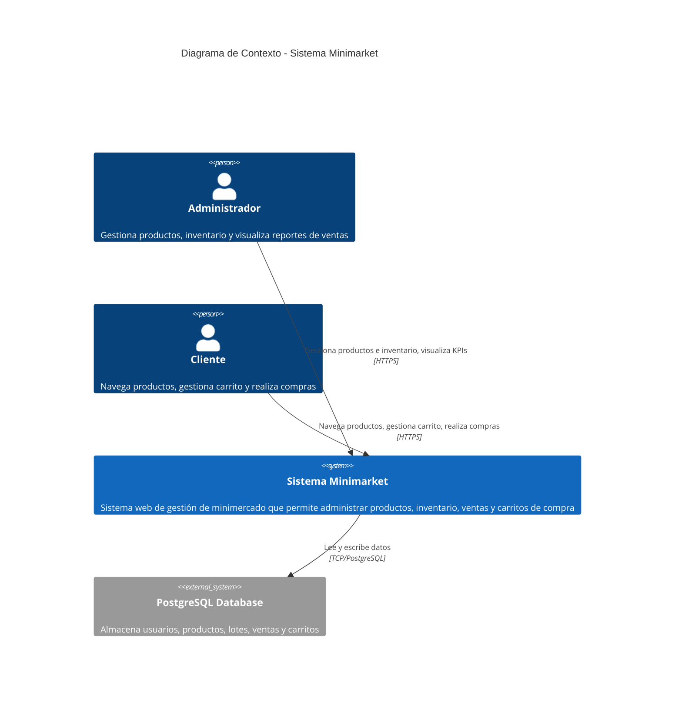
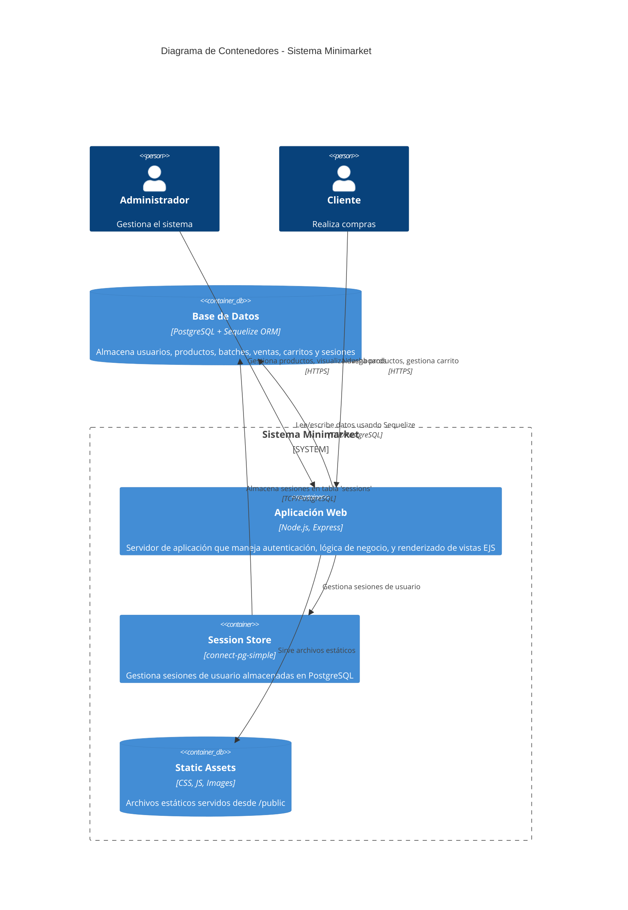

# Diagrama C4 - Sistema Minimarket

Este documento presenta los diagramas C4 del Sistema de Gestión de Minimarket en dos niveles: Context y Container.

## Nivel 1: Context Diagram

El diagrama de contexto muestra el sistema Minimarket y cómo interactúa con los usuarios y sistemas externos.

## Nivel 2: Container Diagram

El diagrama de contenedores muestra los principales componentes técnicos del sistema Minimarket.

## Componentes Principales

### Aplicación Web (Node.js/Express)
- **Rutas principales**:
  - `/auth` - Autenticación (login, registro, logout)
  - `/products` - Gestión de productos
  - `/cart` - Gestión de carrito de compras
  - `/api/sales` - API de ventas
  - `/api` - API general (usuarios, productos)
  - `/api/kpis` - Datos de KPIs para dashboards

- **Middleware**:
  - Autenticación de usuarios
  - Gestión de sesiones
  - Upload de archivos (Multer)

### Base de Datos PostgreSQL
- **Modelos principales**:
  - `User` - Usuarios (admin/cliente)
  - `Product` - Productos del minimercado
  - `Batch` - Lotes de productos con fechas de vencimiento
  - `Sale` - Ventas realizadas
  - `SaleProduct` - Relación many-to-many entre ventas y productos
  - `Cart` - Carritos de compra
  - `CartItem` - Items en los carritos
  - `sessions` - Tabla de sesiones (gestionada por connect-pg-simple)

### Session Store
- Utiliza `connect-pg-simple` para almacenar sesiones en PostgreSQL
- Configuración: 30 minutos de inactividad, renovación automática en cada petición
- Almacenamiento persistente en tabla `sessions`
