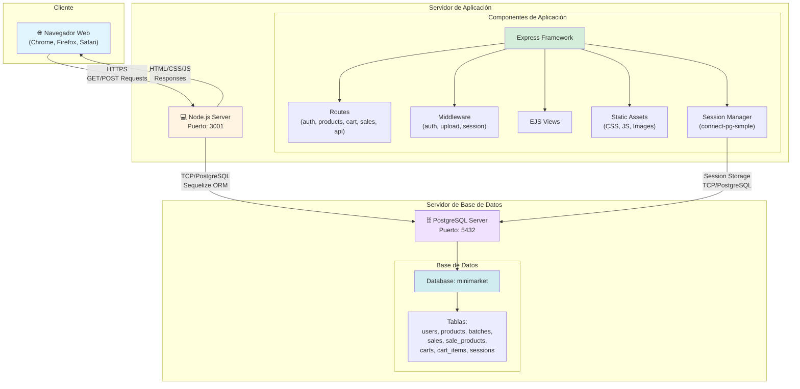

# Diagrama de Despliegue - Sistema Minimarket

Este documento presenta el diagrama de despliegue del Sistema de Gestión de Minimarket, mostrando la arquitectura de infraestructura y cómo se distribuyen los componentes en diferentes nodos.

## Diagrama de Despliegue



## Descripción de Nodos

### 1. Cliente (Navegador Web)
- **Tipo**: Dispositivo del usuario
- **Tecnología**: Navegador web moderno (Chrome, Firefox, Safari, Edge)
- **Función**: Interfaz de usuario que permite a administradores y clientes interactuar con el sistema
- **Comunicación**: Envía peticiones HTTP/HTTPS al servidor de aplicación

### 2. Servidor de Aplicación (Node.js)
- **Tipo**: Servidor de aplicación
- **Tecnología**: Node.js v14+ con Express Framework
- **Puerto**: 3001 (configurable via variable de entorno PORT)
- **Componentes desplegados**:
  - **Express Framework**: Framework web que maneja routing y middleware
  - **Routes**: Módulos de rutas para diferentes funcionalidades
    - `/auth` - Autenticación y autorización
    - `/products` - Gestión de productos
    - `/cart` - Gestión de carrito de compras
    - `/api/sales` - API de ventas
    - `/api` - API general
  - **Middleware**:
    - Autenticación (`auth.js`)
    - Upload de archivos (`upload.js` con Multer)
    - Gestión de sesiones (Express-session)
  - **EJS Views**: Templates del lado del servidor para renderizado HTML
  - **Static Assets**: Archivos CSS, JavaScript e imágenes servidos desde `/public`
  - **Session Manager**: Gestión de sesiones con `connect-pg-simple`

### 3. Servidor de Base de Datos (PostgreSQL)
- **Tipo**: Servidor de base de datos relacional
- **Tecnología**: PostgreSQL 12+
- **Puerto**: 5432 (puerto por defecto de PostgreSQL)
- **Base de Datos**: `minimarket`
- **Tablas principales**:
  - `users` - Usuarios del sistema (admin/cliente)
  - `products` - Catálogo de productos
  - `batches` - Lotes de productos con fechas de vencimiento
  - `sales` - Registro de ventas
  - `sale_products` - Relación many-to-many entre ventas y productos
  - `carts` - Carritos de compra
  - `cart_items` - Items en los carritos
  - `sessions` - Sesiones de usuario (gestionada por connect-pg-simple)

## Protocolos de Comunicación

### Cliente ↔ Servidor de Aplicación
- **Protocolo**: HTTP/HTTPS
- **Puerto**: 3001
- **Métodos**: GET, POST, PUT, DELETE
- **Formato de datos**: HTML, JSON, Form Data
- **Seguridad**: HTTPS en producción, cookies httpOnly para sesiones

### Servidor de Aplicación ↔ Servidor de Base de Datos
- **Protocolo**: TCP/PostgreSQL
- **Puerto**: 5432
- **ORM**: Sequelize
- **Pool de conexiones**: Gestionado por Sequelize
- **Autenticación**: Usuario y contraseña de PostgreSQL (configurados en `.env`)

## Configuración de Entorno

Las siguientes variables de entorno son necesarias para el despliegue:

```
PORT=3001
DB_HOST=localhost
DB_PORT=5432
DB_NAME=minimarket
DB_USER=postgres
DB_PASSWORD=<password>
JWT_SECRET=<secret>
NODE_ENV=production
```

## Consideraciones de Despliegue

1. **Escalabilidad**: El servidor Node.js puede escalarse horizontalmente usando un load balancer
2. **Seguridad**: 
   - Usar HTTPS en producción
   - Configurar firewall para limitar acceso al puerto 5432
   - Variables de entorno seguras para credenciales
3. **Disponibilidad**: 
   - Considerar réplicas de PostgreSQL para alta disponibilidad
   - Usar PM2 o similar para gestión de procesos Node.js
4. **Monitoreo**: Implementar logging y monitoreo de ambos servidores
